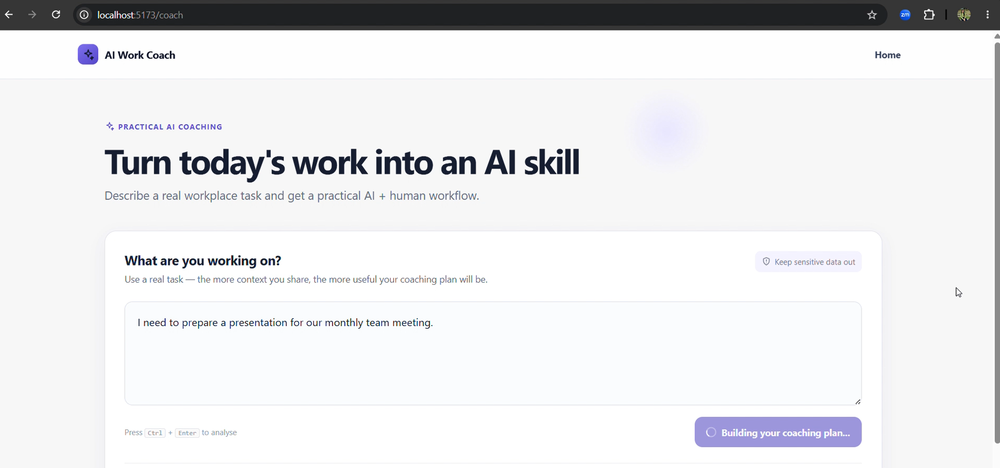
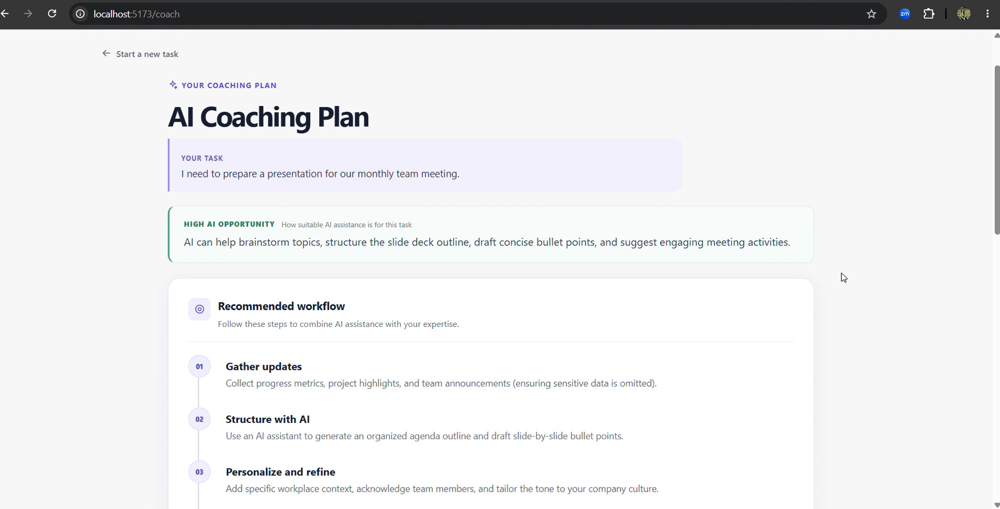
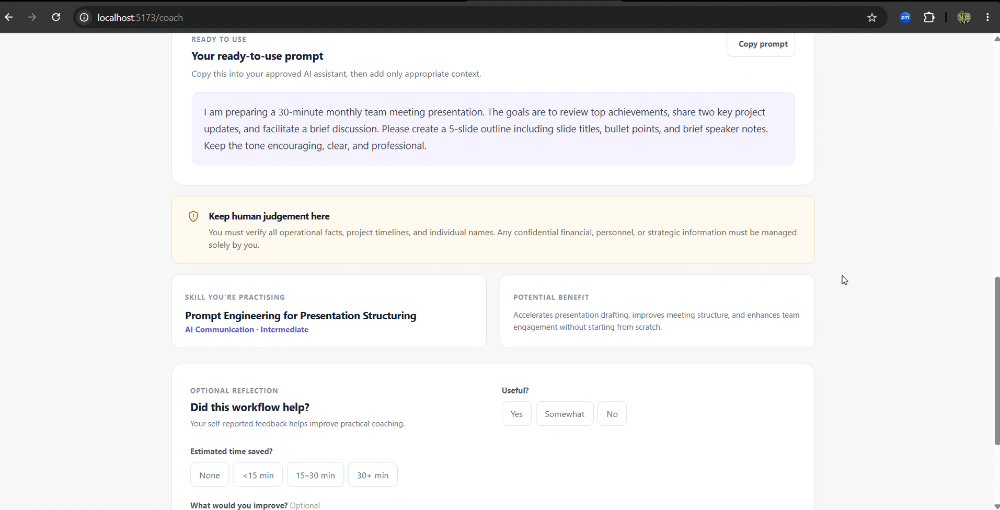

# AI Work Coach

AI Work Coach helps employees turn real workplace tasks into practical, responsible AI-assisted workflows.

Instead of simply completing the employee's task, the application coaches them on **where AI can help, how to work with AI, what prompt to use, and what still requires human judgement**.

---

## Problem

AI training does not automatically translate into day-to-day AI use.

Employees may understand AI concepts after training but still struggle with a practical question:

> **"How should I use AI for the actual task I need to do today?"**

AI Work Coach is designed to bridge that gap between **AI training and real workplace application**.

---

## Solution

An employee describes a real workplace task.

AI Work Coach then provides:

- an **AI opportunity level** with an explanation;
- a practical **AI + human workflow**;
- a **ready-to-use prompt** for an approved AI assistant;
- the **AI skill being practised**;
- the potential benefit of using AI; and
- clear **human-review guidance** showing what the employee must verify or decide.

The goal is not to replace the employee. It is to help them learn how to use AI effectively and responsibly while completing real work.

---

## How It Works

```text
Real workplace task
        ↓
Identify the AI opportunity
        ↓
Create an AI + human workflow
        ↓
Generate a ready-to-use prompt
        ↓
Keep human judgement and verification
        ↓
Identify the AI skill being practised
        ↓
Optional feedback
```

---

## Prototype Preview

### 1. AI Work Coach

The landing experience introduces the purpose of the product and the training-to-work problem it addresses.



### 2. Describe a Real Workplace Task

Employees can enter a task they are currently working on and ask the coach to analyse how AI could appropriately support it.



### 3. Receive a Practical Coaching Plan

The application uses Gemini through the FastAPI backend to generate a structured coaching plan containing the AI opportunity, recommended workflow, ready-to-use prompt, skill guidance, expected benefit, and human-review guidance.



---

## Features

- **Task-specific AI coaching** generated using Gemini.
- **AI opportunity assessment** explaining where AI can realistically help.
- **AI + human workflow** rather than simply asking AI to complete the task.
- **Ready-to-use prompt** that employees can take to an approved AI assistant.
- **Human-review guidance** showing what must still be verified or decided by a person.
- **AI skill identification** to connect real work with skill development.
- **Responsible-AI guidance** for sensitive and consequential workplace tasks.
- **Optional feedback** for evaluating the prototype experience.
- Structured Gemini responses validated using **Pydantic**.

---

## Architecture

```text
React / Vite Frontend
        ↓
POST /api/analyze
        ↓
FastAPI Backend
        ↓
Google Gemini
        ↓
Pydantic Structured Validation
        ↓
Coaching Plan
```

The frontend sends the employee's task to `POST /api/analyze`.

The FastAPI backend validates the request and calls Gemini using a workplace-coaching system instruction. Gemini returns structured JSON matching the `AnalysisResponse` contract.

The backend validates the generated response with Pydantic before returning it to the frontend.

`POST /api/feedback` validates and acknowledges optional prototype feedback. Feedback is **not persistently stored** in the current prototype.

---

## Responsible AI

Responsible AI is built into the coaching workflow rather than treated only as a disclaimer.

The prototype:

- reminds employees to keep unnecessary sensitive information out of prompts;
- discourages sharing passwords, credentials, and unnecessary personal or customer information;
- keeps final human judgement for consequential decisions;
- treats AI as support rather than the final decision-maker for hiring, firing, legal, medical, financial, and similar high-impact tasks;
- includes explicit human-review guidance in the coaching plan; and
- avoids unsupported claims about exact productivity improvements.

Employees remain responsible for verifying AI-generated guidance before using it in their work.

---

## Prototype Scope

This prototype is intentionally small and focused.

It currently includes the complete core workflow from a workplace task to a structured AI coaching plan.

The following are intentionally outside the prototype scope:

- authentication and user accounts;
- persistent feedback storage;
- employee history;
- manager or organization dashboards;
- advanced adoption analytics;
- company-specific integrations;
- organization-specific knowledge retrieval; and
- multiple AI model providers.

These would be considered for a production version after validating the core workflow with users.

---

## Tech Stack

**Frontend**

- React
- Vite
- React Router

**Backend**

- Python
- FastAPI
- Pydantic

**AI**

- Google Gemini API
- Structured model output

---

## Local Setup

### Prerequisites

- Node.js 18+
- Python 3.9+
- Gemini API key

### 1. Configure the backend

Copy:

```text
backend/.env.example
```

to:

```text
backend/.env
```

Then configure the required environment variables.

Never commit the real `.env` file or API key.

### 2. Start the backend

```powershell
cd backend

python -m venv .venv

.\.venv\Scripts\Activate.ps1

pip install -r requirements.txt

uvicorn app.main:app --reload --port 8000
```

### 3. Start the frontend

Open another terminal:

```powershell
cd frontend

npm install

npm run dev
```

Then open:

```text
http://localhost:5173
```

---

## Environment Variables

| Variable | Location | Purpose |
| --- | --- | --- |
| `GEMINI_API_KEY` | Backend | Gemini API key. Never commit this value. |
| `GEMINI_MODEL` | Backend | Gemini model used by the application. |
| `FRONTEND_ORIGIN` | Backend | Deployed frontend origin, without a trailing slash. |
| `ALLOWED_ORIGINS` | Backend (optional) | Comma-separated allowed origins when multiple deployed origins are required. |
| `VITE_API_BASE_URL` | Frontend | Public URL of the deployed FastAPI backend. |

> Never expose `GEMINI_API_KEY` through a `VITE_*` environment variable. Gemini requests are made only through the backend.

---

## Deployment Configuration

For deployment, configure the backend with:

```text
GEMINI_API_KEY
GEMINI_MODEL
FRONTEND_ORIGIN
```

Configure the frontend with:

```text
VITE_API_BASE_URL
```

`VITE_API_BASE_URL` should point to the deployed FastAPI backend.

The API keeps the local Vite origins for development and allows configured production origins without using wildcard CORS.

Because the frontend uses client-side routing, the frontend host should rewrite unknown routes to `index.html` so direct navigation to routes such as `/coach` continues to work.

---

## Limitations and Next Steps

AI Work Coach is currently a focused prototype designed to validate the core idea.

A production version could add:

- organization authentication and role-based access;
- persistent and privacy-appropriate feedback data;
- company-approved AI tools and policies;
- organization-specific knowledge;
- team-level AI skill and adoption insights;
- stronger monitoring and evaluation; and
- enterprise privacy, retention, and governance controls.

The next step would be to test the workflow with real employees and evaluate whether the coaching helps them apply AI training more effectively in their day-to-day work.